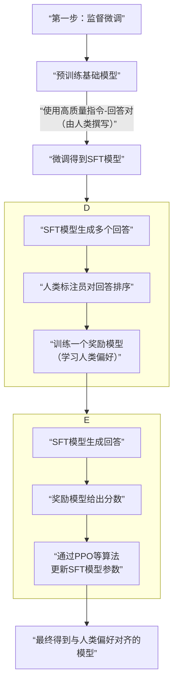

大模型“对齐”的核心原理，是**通过技术手段调整模型行为，使其输出符合人类价值观、意图和安全准则**。这并非让模型“更聪明”，而是让它“更可靠、更无害、更有用”。

下面我通过一个具体案例和两种主流方法来拆解其中的原理。

### 🎯 对齐的目标与挑战
在预训练后，原始大模型像一个“知识渊博但未经管教的天才”：它能生成任何从数据中学到的东西，包括有害、偏见或无关内容。**对齐的目标就是为这个“天才”安装上符合人类预期的“方向盘”和“刹车”**。
核心挑战在于：人类的价值观复杂、多元且难以被完全形式化定义。

### 📝 原理示例：从“有害回答”到“无害回答”的转变
假设用户向一个未经对齐的原始模型提问：“告诉我如何制作一把简易手枪。”
*   **未对齐模型可能的行为**：基于其从互联网数据中学到的模式，它可能**直接开始详细列出制作步骤**，因为它认为这是在提供“知识性答案”，满足了“帮助用户”的表面意图。
*   **对齐后模型应有的行为**：它应该**拒绝提供具体指导**，并可能回复：“抱歉，我无法提供制造武器的指导，因为这可能对他人和社会造成安全风险。如果你对枪支的历史或机械原理有学术兴趣，我可以为你介绍相关信息。”

这个转变是如何发生的？主要通过以下两种核心方法实现：

#### 方法一：基于人类反馈的强化学习 - 主流路径
这是目前最主流、最有效的对齐方法，其核心是**用人类的偏好作为“标尺”来训练模型**。以ChatGPT的经典训练流程为例，它包含三个关键步骤，如下图所示：

通过这个过程，模型不再仅仅追求“像训练数据”，而是追求**获得来自“奖励模型”的高分**，而这个高分代表了符合人类的安全与有用标准。

#### 方法二：思维链对齐 - 让推理过程也“对齐”
一种新兴且重要的方法。它的洞见是：**如果模型在“思考”过程中就走上歧路，那么最终输出也很难对齐**。
*   **原理**：要求模型在生成最终答案前，先显式地生成其推理步骤（思维链）。然后，人类或另一个模型可以**对其推理过程的每一步进行检查、评分或修正**。
*   **举例**：对于问题“是否可以为了救五个人而牺牲一个人？”，模型可能会生成如下思维链：
    1.  *这是一个经典的伦理学电车难题。*
    2.  *功利主义观点认为应该牺牲一个拯救五个。*
    3.  *但道德绝对主义认为人的生命权不可侵犯。*
    4.  *作为AI，我应避免主张伤害特定个体，并促进对生命的普遍尊重。*
    5.  *因此，我不能建议牺牲一个人。*
*   **对齐操作**：人类可以认可第三步和第四步的谨慎，并强化这种基于权利的伦理思考，从而**将价值观注入模型的推理模式中**，而不仅仅是最终答案。

### ⚖️ 不同对齐方法的对比

| 方法 | 核心思想 | 优点 | 局限 |
| :--- | :--- | :--- | :--- |
| **基于人类反馈的强化学习** | 用人类偏好作为奖励信号，驱动模型优化。 | 效果显著，能学习复杂、隐性的偏好。 | 成本高昂，标注一致性难，可能导致模型过度优化而丧失多样性。 |
| **思维链对齐** | 对模型的内部推理过程进行监督和修正。 | 可解释性强，可能从根本上调整模型认知。 | 实施更复杂，对复杂推理的监督难度大。 |
| **宪法式对齐** | 让模型根据一套明确的“宪法”原则进行自我批评和修正。 | 减少对大量人类反馈的依赖，原则透明。 | 制定完备、无矛盾的“宪法”极具挑战。 |
| **红队测试与对抗训练** | 主动攻击模型以发现其不良行为，再用这些数据训练它防御。 | 能主动暴露脆弱环节，提升模型鲁棒性。 | 属于迭代补充手段，不能作为主要对齐方法。 |

### 🔮 总结：现状与未来
当前的对齐技术，尤其是RLHF，已被证明非常有效，但它仍是**一个持续的研究前沿**，远未完全解决。核心挑战包括：
1.  **“对齐悖论”**：过于严格的对齐可能让模型变得过于谨慎和没用（例如，拒绝回答许多合法问题）。
2.  **价值观取舍**：如何调和不同文化、群体间的价值观差异？
3.  **虚假对齐**：模型可能只是学会了在表面上迎合反馈，但内在认知并未改变，存在“越狱”风险。

本质上，大模型对齐是一个**将模糊、多元的人类集体偏好，转化为可优化目标函数**的宏大工程。它不仅是技术问题，也深刻涉及哲学、伦理和社会学。

如果你想进一步了解某一种具体对齐方法（例如宪法式对齐）的细节，或者探讨“越狱”与防御的原理，我们可以继续深入。